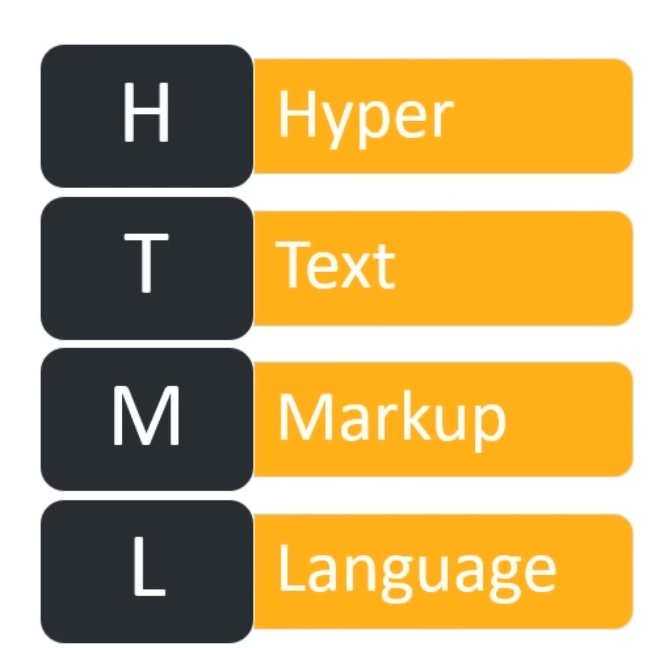
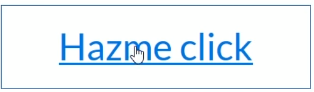
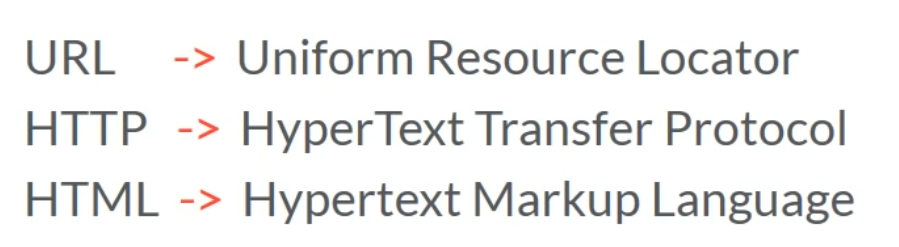
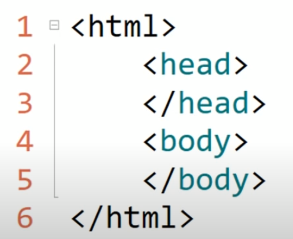

# Curso HTML 

Material elaborado por Víctor Miguel Barrera Peña
Versión 1.0
Día inicio de elaboración 21/07/2020

---

Versiones del curso

- 1.0 Este material Es una versión recopilatoria de cursos
- 2.0 La siguiente versión es un rediseño del mismo volumen para ahora ser escrito todo con texto e ilustraciones propias.
- 3.0 Versión que ya es un propio curso desde 0, dejando a un lado una recopilación y basandose en propio conocimiento del escritor.
- XXX.0 Versiones con nuevas actualizaciones, mejoras o colaboradores.

---

# Curso HTMl Desde 0

Impartido por EDteam

---

# [Introducción](https://www.youtube.com/watch?v=rpPUQ2qVFYw&list=PLv6CkzbbGAlXld23oW5eTzoSrtHkV6i99)

---

#  ¿Qué es HTML?

- Es un lenguaje interpretado
  - Etiende lo que yo escribo y lo traduce
  - Lo marcas con html y lo interpreta en lo que tu ves




---

# ¿Por qué el marcado?


Porque asi identificamos que corresponde a cada cosa, como en estos frascos.

---

# Hypertexto



Daz un click y te lleva a otro lado

Es como el pie de texto , que te refencia a otro lado
En teoría todo esta concetado.


---

# La web e internet



internet --> infrestructura para comunicarnos en red fisica
web --> conjuntos de documentos de html conectados por hipertexto.

---

# ¿ Comó es HTML?




---

Tiene etiquetas que se cierran , como por ejemplo 

```html
<html></html>
```
y etiquetas que se autocierran llamadas closelft o algo asi
```html
<br>
```
